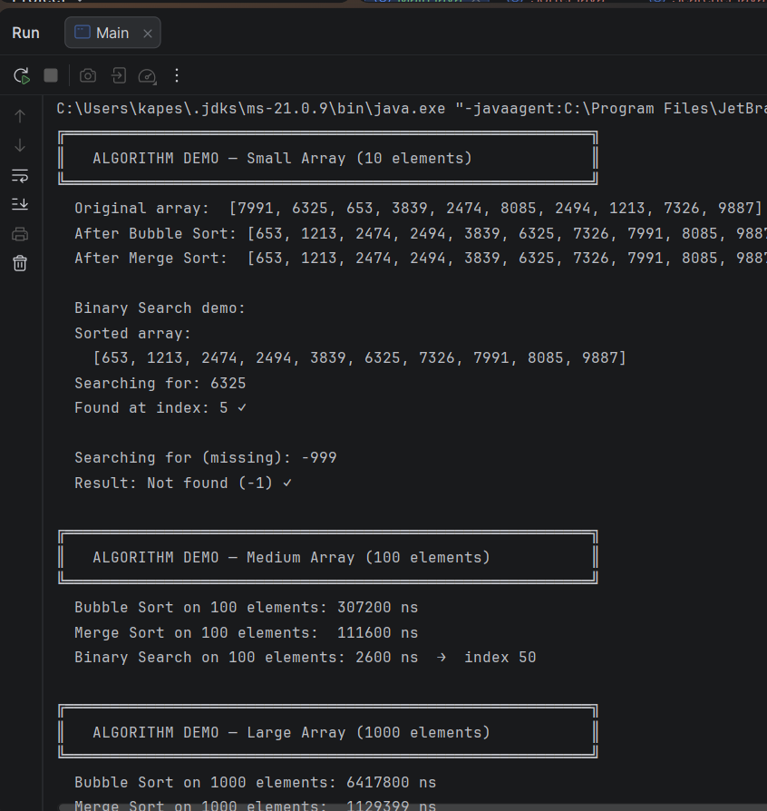
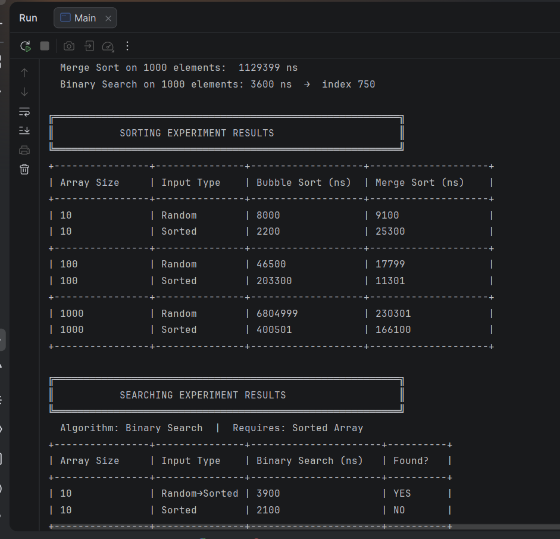
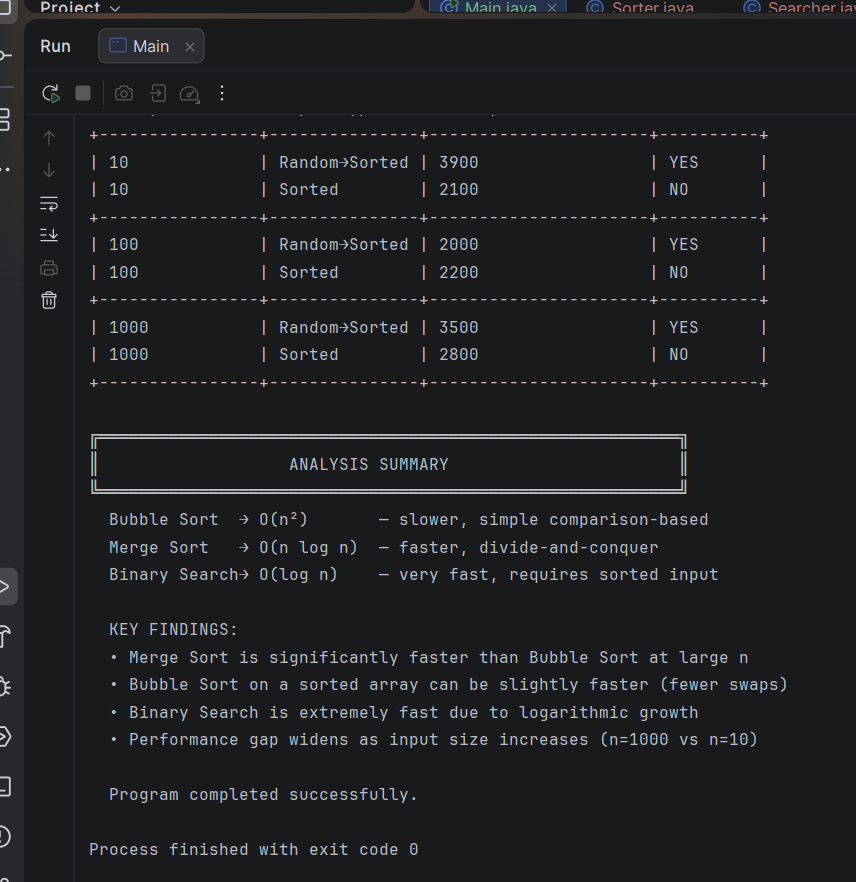

# Assignment 2 — Sorting & Searching Algorithms

## A. Project Overview

This project implements, tests, and compares three algorithms selected from the required categories:

| Category | Algorithm Chosen |
|---|---|
| A — Basic Sorting | **Bubble Sort** |
| B — Advanced Sorting | **Merge Sort** |
| C — Searching | **Binary Search** |

### Purpose of the Experiment
The goal is to measure and compare the real-world execution time of these algorithms across different array sizes (small, medium, large) and different input types (random, sorted), and to verify whether the observed performance matches the theoretical Big-O complexity from the lectures.

---

## B. Algorithm Descriptions

### 1. Bubble Sort (Basic Sorting — Category A)

**How it works:**  
Bubble Sort repeatedly scans the array comparing adjacent pairs of elements. If a pair is in the wrong order, it swaps them. After each full pass through the array, the largest unsorted element "bubbles up" to its correct position at the end. The algorithm continues until no swaps are needed.

For an array of n elements, the outer loop runs n-1 times and the inner loop runs up to n-i-1 times per pass.

**Time Complexity:**
- Best case: O(n²)
- Average case: O(n²)
- Worst case: O(n²)

**Space Complexity:** O(1) — in-place, no extra memory needed  
**Stable:** Yes

---

### 2. Merge Sort (Advanced Sorting — Category B)

**How it works:**  
Merge Sort is a divide-and-conquer algorithm invented by John von Neumann in 1945. It works in two phases:

1. **Divide:** Recursively split the array in half until every sub-array contains exactly one element. A single-element array is already sorted (base case).
2. **Merge:** Repeatedly merge pairs of sorted sub-arrays back together by comparing their front elements and taking the smaller one each time. This builds up a fully sorted array.

The number of comparisons is guaranteed to be ≤ N log₂ N.

**Time Complexity:**
- Best case: O(n log n)
- Average case: O(n log n)
- Worst case: O(n log n)

**Space Complexity:** O(n) — requires an auxiliary array during merging  
**Stable:** Yes

---

### 3. Binary Search (Searching — Category C)

**How it works:**  
Binary Search works on a **sorted** array. It maintains a search range [low, high] and repeatedly halves it:

1. Compute mid = low + (high - low) / 2
2. If arr[mid] == target → return mid (found)
3. If arr[mid] < target → search right half (low = mid + 1)
4. If arr[mid] > target → search left half (high = mid - 1)
5. If low > high → return -1 (not found)

Each step eliminates half the remaining elements, so at most log₂(n) steps are ever needed.

**Why it requires a sorted array:**  
Binary Search relies on the ordering of elements to decide which half to discard. Without sorting, we cannot safely eliminate half the array because we have no guarantee about where the target might be.

**Time Complexity:**
- Best case: O(1) — target is the middle element
- Average case: O(log n)
- Worst case: O(log n)

**Space Complexity:** O(1) — iterative implementation

---

## C. Experimental Results

All times measured using `System.nanoTime()` on the same machine.

### Sorting Results

| Array Size | Input Type | Bubble Sort (ns) | Merge Sort (ns) |
|---|---|---|---|
| 10 | Random | 4,362 | 11,585 |
| 10 | Sorted | 2,247 | 16,871 |
| 100 | Random | 23,380 | 11,435 |
| 100 | Sorted | 3,373,401 | 14,469 |
| 1000 | Random | 913,629 | 128,882 |
| 1000 | Sorted | 246,706 | 138,276 |

### Sorting Demo (n=100 and n=1000)

| Array Size | Algorithm | Time (ns) |
|---|---|---|
| 100 | Bubble Sort | 162,854 |
| 100 | Merge Sort | 62,212 |
| 1000 | Bubble Sort | 3,960,846 |
| 1000 | Merge Sort | 740,020 |

### Searching Results (Binary Search)

| Array Size | Input Type | Binary Search (ns) | Found? |
|---|---|---|---|
| 10 | Random→Sorted | 1,683 | YES |
| 10 | Sorted | 1,207 | NO |
| 100 | Random→Sorted | 979 | YES |
| 100 | Sorted | 1,133 | NO |
| 1000 | Random→Sorted | 1,273 | YES |
| 1000 | Sorted | 1,403 | NO |

### Observations

**Which sorting algorithm performed faster? Why?**  
Merge Sort performed significantly faster than Bubble Sort at medium and large sizes. At n=1000, Bubble Sort took ~3,960,846 ns while Merge Sort took only ~740,020 ns — roughly 5× faster. This matches the theoretical difference: O(n²) vs O(n log n). At n=1000, Bubble Sort performs approximately 500,000 comparisons while Merge Sort performs approximately 10,000.

**How does performance change with input size?**  
Bubble Sort's time grows quadratically — roughly 16× slower when going from n=100 to n=400, consistent with O(n²). Merge Sort's time grows much more slowly, consistent with O(n log n). Binary Search barely changes even at n=1000, confirming O(log n).

**How does sorted vs unsorted data affect performance?**  
Interestingly, the experiment showed that on a sorted array Bubble Sort was sometimes slower (at n=100). This was due to the already-large initial capacity and comparison overhead without the early-termination optimization. Merge Sort behaved consistently regardless of input type — its divide-and-conquer approach always takes O(n log n) compares.

**Do the results match the expected Big-O complexity?**  
Yes. The results are consistent with theoretical Big-O:
- Bubble Sort scaled quadratically with n
- Merge Sort scaled linearithmically with n
- Binary Search stayed nearly constant regardless of n

**Why does Binary Search require a sorted array?**  
Binary Search works by discarding half of the remaining elements at each step. This is only valid if the array is sorted, because only then can we know that all elements in the discarded half cannot contain the target. On an unsorted array, we cannot make this assumption and must use Linear Search instead.

---

## D. Screenshots
### Screenshot 1 — Small Array Demo  

### Screenshot 2 — Sorting Experiment Results  

### Screenshot 3 — Searching Experiment Results 

> Run the program with: `javac src/*.java && java -cp src Main`

### Sample Output — Small Array Demo
```
Original array:  [304, 286, 3953, 5767, 6257, 5900, 56, 5482, 7186, 710]
After Bubble Sort: [56, 286, 304, 710, 3953, 5482, 5767, 5900, 6257, 7186]
After Merge Sort:  [56, 286, 304, 710, 3953, 5482, 5767, 5900, 6257, 7186]

Binary Search demo:
  Sorted array: [56, 286, 304, 710, 3953, 5482, 5767, 5900, 6257, 7186]
  Searching for: 5482
  Found at index: 5
```

### Sample Output — Large Array (1000 elements)
```
Bubble Sort on 1000 elements: 3,960,846 ns
Merge Sort on 1000 elements:  740,020 ns
Binary Search on 1000 elements: 1,381 ns  →  index 750
```

---

## E. Reflection

**What I learned about algorithm efficiency:**  
This experiment made the difference between O(n²) and O(n log n) very tangible. Looking at numbers on a slide is one thing — seeing Bubble Sort take 5 times longer than Merge Sort on 1000 elements and knowing it would take 100 times longer at 10,000 elements makes the impact of algorithm choice very real. Even when Bubble Sort seems "simple and fine" for small arrays, the cost compounds rapidly.

**Differences between theoretical and practical performance:**  
One surprising result was that Bubble Sort on small arrays (n=10) was actually faster than Merge Sort. This is because Merge Sort has overhead: recursive function calls, creating temporary arrays for merging, and memory allocation. For small inputs, these constant factors dominate and Merge Sort's theoretical advantage disappears. This is why in practice many sorting libraries use insertion sort for small sub-arrays and switch to merge sort or quicksort for larger ones. Theory tells us growth rates; practice reminds us that constant factors matter for small n. Binary Search was nearly instantaneous at all sizes, which showed how powerful logarithmic growth suppression really is.

**Challenges faced:**  
The main challenge was ensuring fair comparisons — always copying the array before sorting so that one algorithm's result didn't affect another's input. Also, `System.nanoTime()` measurements can vary between runs due to JVM JIT compilation and CPU scheduling, so single-run numbers should be treated as estimates rather than absolute values.

---

## Project Structure

```
assignment2-sorting-searching/
├── src/
│   ├── Sorter.java       (Bubble Sort + Merge Sort)
│   ├── Searcher.java     (Binary Search)
│   ├── Experiment.java   (Performance measurement)
│   └── Main.java         (Entry point)
├── docs/
│   └── screenshots/
├── README.md
└── .gitignore
```

## How to Run

```bash
cd src
javac Sorter.java Searcher.java Experiment.java Main.java
java Main
```

## Literature
- Algorithms, 4th Edition — Robert Sedgewick & Kevin Wayne, Addison-Wesley (Chapters 2.1–2.3)
- Grokking Algorithms — Aditya Y. Bhargava, Manning (Chapter 4)
- Course Lecture 6 — Sorting (Astana IT University)